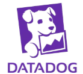

 Datadog is a cloud-based monitoring and security platform for IT infrastructure, applications, and services. It helps organizations gain visibility into their systems through metrics, logs, and traces—all in one place.

---

```markdown
# 🐶 Datadog Monitoring Guide

This guide helps you understand and get started with **Datadog**, covering the major monitoring components:

1. Infrastructure Monitoring  
2. APM (Application Performance Monitoring)  
3. Tracing  
4. Logs  
5. Synthetic Monitoring  
6. RUM (Real User Monitoring)  
7. Dashboards  
8. Alerts (Monitors)

---

## 1️⃣ Infrastructure Monitoring

**Goal:** Monitor servers, containers, cloud infrastructure, and services.

- Install the [Datadog Agent](https://docs.datadoghq.com/agent/) on your hosts.
- It automatically collects system metrics like CPU, memory, disk, network, and more.
- Integrates with over 600+ technologies (AWS, Docker, Kubernetes, etc.)

**Example metrics:**
- `system.cpu.user`
- `system.mem.used`
- `docker.cpu.usage`

---

## 2️⃣ APM (Application Performance Monitoring)

**Goal:** Track the performance of your applications and services.

- Install the Datadog APM libraries in your application.
- Supports many languages: Python, Java, Node.js, Go, Ruby, etc.
- Captures latency, throughput, and error rate of your endpoints.

**Key Concepts:**
- Services
- Spans
- Traces

---

## 3️⃣ Tracing

**Goal:** Understand request flow through your system.

- Traces show how requests move across services.
- Useful for identifying bottlenecks or slow dependencies.
- Automatically captures spans for HTTP requests, database calls, and more.

**Example:**
```

User → Frontend → API → Database

```

---

## 4️⃣ Logs

**Goal:** Collect, search, and analyze logs from all systems.

- Enable log collection in the Agent (`logs_enabled: true`).
- Supports structured and unstructured logs.
- Ingest logs from Apache, NGINX, applications, or via Syslog/Fluentd/Filebeat.

**Features:**
- Live tail
- Log patterns
- Error tracking

---

## 5️⃣ Synthetic Monitoring

**Goal:** Test your web apps and APIs from global locations.

- Simulates user behavior to test uptime and functionality.
- Types:
  - **API Tests:** Validate API endpoints.
  - **Browser Tests:** Simulate user journeys in a browser.

**Use Cases:**
- Catch broken pages before users do
- Monitor API response times

---

## 6️⃣ RUM (Real User Monitoring)

**Goal:** Track actual user experience on web and mobile apps.

- Captures frontend performance data like page load time, JS errors, and user actions.
- Helps detect issues specific to certain browsers, locations, or devices.

**How to enable:**
- Add the RUM JavaScript SDK to your web app.
- Use RUM mobile SDKs for iOS/Android.

---

## 7️⃣ Dashboards

**Goal:** Visualize metrics, logs, traces, and more in one place.

- Create custom dashboards for teams, applications, services.
- Use widgets like timeseries, query values, toplists, etc.
- Share dashboards via links or embed them.

**Example widgets:**
- CPU usage over time
- Top 5 endpoints by latency
- Errors by service

---

## 8️⃣ Alerts (Monitors)

**Goal:** Automatically detect and notify you about problems.

- **Monitors** trigger alerts when conditions are met.
- Types:
  - Metric
  - Log
  - APM
  - Synthetic
  - Process
- Notify via Slack, email, PagerDuty, etc.

**Example:**
> Alert when `system.cpu.user` > 90% on any host for 5 minutes.

---

## 📚 Resources
```
- [Datadog Docs](https://docs.datadoghq.com/)
- [Agent Installation](https://docs.datadoghq.com/agent/)
- [APM Setup](https://docs.datadoghq.com/tracing/)
- [Log Collection](https://docs.datadoghq.com/logs/)
- [RUM Setup](https://docs.datadoghq.com/real_user_monitoring/)
- [Synthetic Monitoring](https://docs.datadoghq.com/synthetics/)
---
